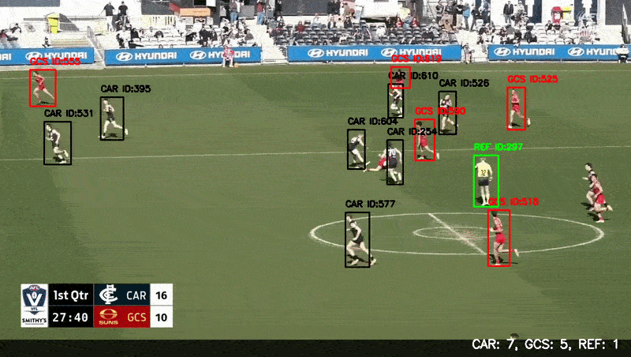

# AFL Player Detection and Tracking using YOLO + ByteTrack 🏉🇦🇺

End-to-end computer vision pipeline for detecting and tracking AFL players and referees in short broadcast video clips using a custom YOLO model and ByteTrack.

---

## Overview 📍

- **Input:** Short AFL broadcast video clip  
- **Output:** Bounding boxes, class labels, tracking IDs, live counts, CSV tracking results  
- **Model:** Custom YOLO model (`best_v1.pt`)  
- **Tracking:** ByteTrack  
- **Framework:** Ultralytics YOLO  
- **Video Processing:** OpenCV  
- **Classes Detected:** `CAR`, `GCS`, `REF`
- **Final Performance:**  
  - **mAP@50:** 0.960    
  - **mAP@50–95:** 0.491 
  - **Precision:** 0.952   
  - **Recall:** 0.922   

---
## Dataset 📊

The dataset used in this project was created by extracting frames from AFL match footage at approximately **10-second intervals** between consecutive frames. This produced a dataset of **200 images in total**, which were then manually annotated in **Label Studio** across three classes:

- **CAR** — Carlton players  
- **GCS** — Gold Coast Suns players  
- **REF** — Referees  

Training images were taken from AFL broadcast footage under varying match conditions, including different zoom levels, player density, lighting conditions, and camera perspectives. Including this variation helps improve generalisation to real match footage, where crowding, occlusion, and movement are common.

---

## Process ⚙️

Initial experimentation and model training were carried out in **Google Colab** using an **NVIDIA Tesla T4 GPU**, which allowed for faster training and easier iteration during development. The detector was trained as a custom YOLO model on manually labelled AFL broadcast frames containing the three target classes: `CAR`, `GCS`, and `REF`.

After training, the project was moved into a simple local Python pipeline for video inference. Instead of keeping everything inside a notebook, the code was organised into separate Python files for video input/output, tracking, drawing annotations, and CSV export. This made the project easier to test, reuse, and run on different clips.

For inference, each input video is read frame by frame using OpenCV. The trained YOLO model is then run in tracking mode with **ByteTrack**, which assigns temporary IDs to detected objects across nearby frames. The pipeline draws class-coloured bounding boxes, labels, track IDs, and live class counts onto each frame before saving the final annotated video.

At the same time, the tracking results are exported to a CSV file containing frame number, track ID, class name, confidence score, bounding box coordinates, and box centre coordinates. This makes the output easier to analyse later and gives the project a more complete end-to-end computer vision workflow.

---

## Assumptions and Limitations 🚧

This project was built for short AFL broadcast clips and works best when the input video is similar to the footage used during training. Some of the main assumptions and limitations are listed below.

1. **Team colours and match context**  
   The model was trained on footage from Carlton vs Gold Coast Suns matches, where Carlton players wore mostly black jerseys, Gold Coast players wore red, and referees wore lime green. Because of this, the model is likely to perform best when the team colours and overall match setup are visually similar to the training data.

2. **Broadcast camera changes**  
   Sharp camera cuts, sudden zooms, or switches to different broadcast angles can reduce tracking consistency. In these situations, ByteTrack may lose an existing ID and assign a new one. This means the system is more reliable on short continuous clips than on long sequences with lots of camera changes.

3. **Crowding, tackles, and collisions**  
   The detector is usually still able to identify players during tackles and congested contests, but the tracker may struggle to keep the same ID when multiple players overlap heavily or move unpredictably in a small area.

4. **Lighting conditions**  
   The model works best in clear broadcast footage with good lighting. Performance may decrease in darker scenes, heavy shadows, glare, or lower-quality video.

5. **Temporary tracking IDs**  
   ByteTrack IDs are only temporary tracking IDs, not real player identities. For example, a label like `CAR ID:4` does not mean the system knows which AFL player it is. It only means the tracker believes it is the same detected object across nearby frames.

6. **Short-clip focus**  
   The current pipeline is best suited to short continuous clips rather than full-match tracking. Longer sequences with repeated camera changes are more likely to produce imperfect tracking outputs.

7. **Image-space coordinates**  
   The bounding box coordinates exported to CSV are based on screen positions, not calibrated field positions. This makes the data useful for frame-level analysis and short-term tracking, but not for exact real-world field positioning.
